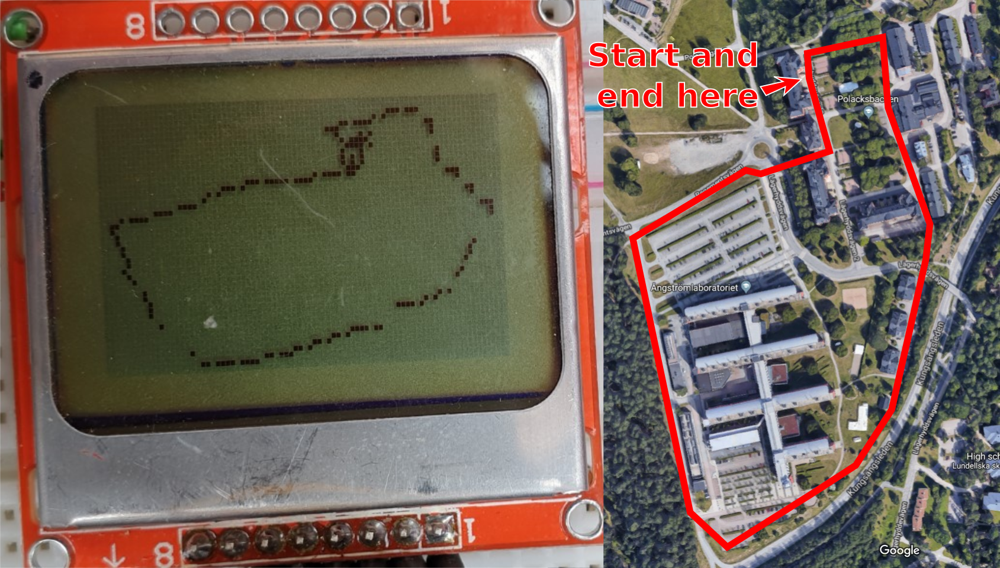

#GPS LOGGER

##Hardware
The GPS-Logger was build with the an ATMEGA328 8-bit microcontroller, a GTPA010 GPS Module and a Nokia 5110 Display.

##Result

GPS-logger can track and show walked path. GPS Logger

GPS-logger setup.